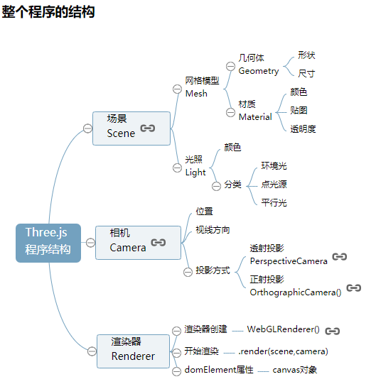
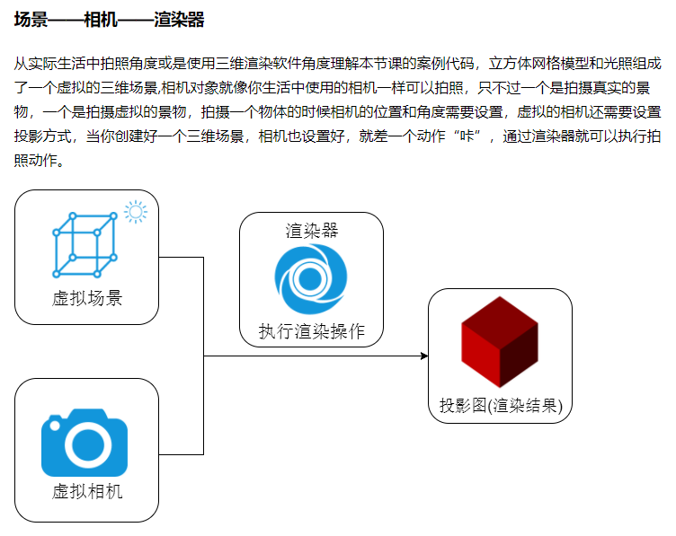
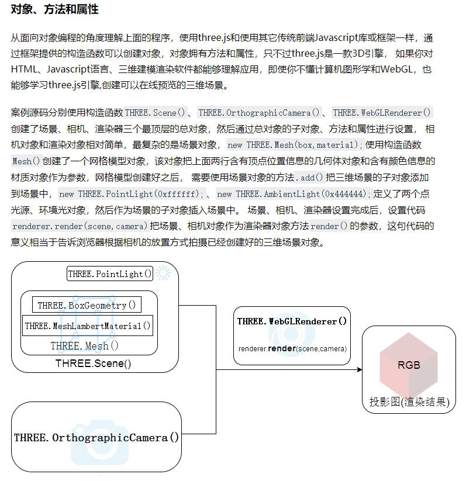
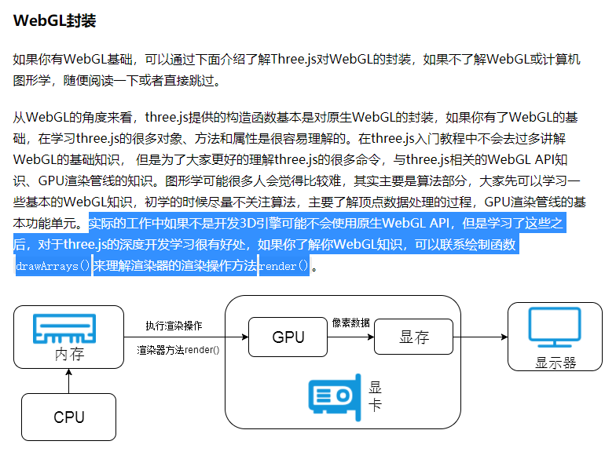
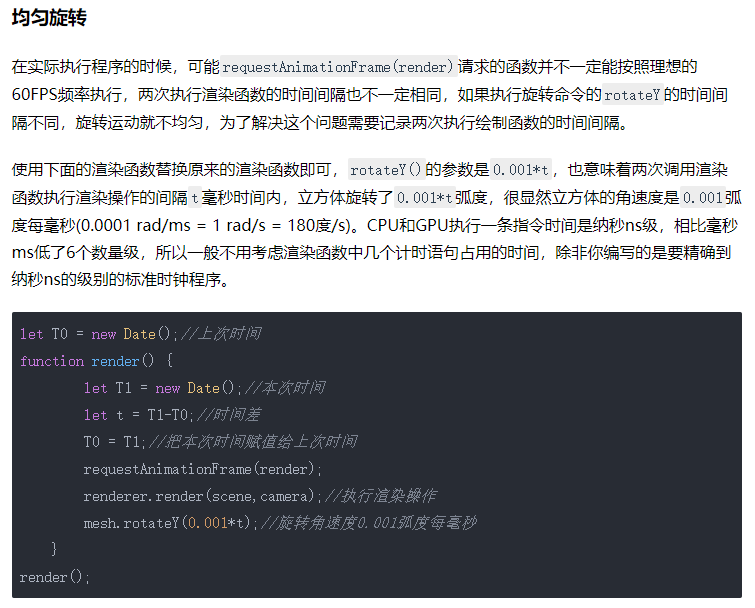

# Threejs 基础
## 主要是为了详细学习Threejs整体与细节知识点，参考资料[《Three.js教程》](http://www.webgl3d.cn/Three.js/ "Three.js教程")

### 场景对象`Scene()`  
```
var scene = new THREE.Scene();
```

### 几何对象`Geometry()`  
```
// 创建球体几何体对象，参数半径、经度细分数，纬度细分数
var geometryA = new THREE.SphereGeometry(60,40,40);
// 创建立方体几何体对象，参数长、宽、高
var geometryB = new THREE.BoxGeometry(100,100,100);
// 创建圆柱体几何体对象，参数圆柱面顶部直径，底部直径，高度，圆周分段数
var geometryC = new THREE.CylinderGeometry(50,50,100,25);

// 创建正八面体
var geometryD = new THREE.OctahedronGeometry(50);
// 创建正十二面体
var geometryE = new THREE.DodecahedronGeometry(50);
// 创建正二十面体
var geometryF = new THREE.IcosahedronGeometry(50);
```

### 材质对象`Material()`  
```
var material = new THREE.MeshLamberMaterial({
	color: 0x0000ff
});
```

### 材质对象常见属性
+ `color`，材质颜色  
+ `wireframe`，将几何图形渲染成为线框  
+ `opacity`，透明度设置，0-1，同css  
+ `transparent`，是否开启透明

### 材质对象常见类型
+ `MeshBasicMaterial`，基础网格材质，不受光照影响的材质  
+ `MeshLambertMarterial`，Lambert网格材质，与光照有反应，漫反射  
+ `MeshPhongMarterial`，高光Phong材质，与光照有反应  
+ `MeshStandarMaterial`，PBR物理材质，相比较高光Phong材质可以更好的模拟金属、玻璃等效果  


### 网络模型对象`Mesh()`，将几何体对象和材质对象添加到场景中  
```
var mesh = new THREE.Mesh(geometryA, material);
scene.add(mesh);
```

### 光源对象`Light()`，创建光源对象并添加到场景中，具体介绍查看 ***three-note -> three-light.md***  
```
// 创建点光源对象，类似在室内开一盏灯那种，会有阴影生成，所以需要指定在什么位置发射光线出来
var point = new THREE.PointLight(0x0000ff);
// 设置点光源位置
point.position.set(400,200,300);
// 将点光源添加到场景中
scene.add(point);

// 创建环境光，散射光，模拟现实环境，不能影响阴影生成，必须和其他光源配合所以还需要点光源配合，它也不需要指定位置
var ombient = new THREE.AmbientLight(0x444444);
scene.add(ambient);
```

### 光源对象常见类型
+ `HemisphereLight`，半球光源，更好的模拟真实环境  
+ `AmbientLight`，环境光  
+ `Pointlight`，点光源  
+ `DirectionalLight`，平行光，比如太阳光  
+ `SpotLight`，聚光源  

### 光源对象常见设置
1. 光照强度，通过改变创建光源对象的颜色参数来实现不同的光照强度  
2. 光源位置，通过`point.position.set(400,300,200)`，`point`是光源对象创建的实例

### 相机对象`OrthographicCamera()`，不太了解，后续了解后补充  
```
// 窗口宽度
var width = window.innerWidth;
// 窗口高度
var height = window.innerHeight;
// 窗口宽高比
var k = width / height;
// 三维场景显示范围控制系数，系数越大，显示的范围越大
var s = 200;
// 创建正射投影相机对象，具体传进去的参数后续了解
var camera = new THREE.OrthographicCamera(-s*k,s*k,s,-s,1,1000);
// 设置相机位置
camera.position.set(200,200,200);
// 设置相机方向，用于指向场景对象
camera.lookAt(sence.position);
```

### 渲染器对象`WebGLRenderer()`，将之前创建的场景对象和相机对象都渲染到DOM元素上  
```
// 创建渲染器对象  
var renderer = new THREE.WebGLRenderer();
// 设置渲染区域尺寸，width和height为上方相机对象用到的窗口尺寸参数
renderer.setSize(width,height);
// 设置渲染区域背景颜色
render.setClearColor(0xb9d3ff,1);
// 在body元素中插入cancvas对象
document.body.appendChild(renderer.domElement);
// 执行渲染操作，添加上方创建的场景对象和相机对象
renderer.render(scene,camera);
```

### Threejs整个程序的结构


### 如何理解Threejs在程序中的渲染


### 通俗的Three概览


### 我可能永远无法达到的高度
  

### 如何实现旋转动画的具体思路
+ 周期性渲染
	1. Threejs 渲染的思路就是`WebGLRenderer()`对象的`.render`方法，相当于绘制一张图像在界面上  
	2. 大致思路就像是日本动画那样的方式，每秒超过24帧的渲染之后形成动画的视觉效果，不过是由函数自动实现  
	3. 应该顺理成章的想到`window`对象的`setInInterval()`周期性函数  
+ 函数`requestAnimationFrame()`
	1. 实际开发中，为了更好的利用浏览器渲染，一般使用`requestAnimationFrame()`方法代替`setInterval()`方法，他们都是`window`对象的方法  
	2. 这个函数的参数是将要调用函数的函数名，而且这个函数不是理解调用，而是向浏览器发起一个执行某个函数的请求，什么时候执行由浏览器决定，一般默认保持60FPS，大约16.7秒调用一次  
	3. [关于该函数更为详细的介绍](http://www.yanhuangxueyuan.com/HTML5/time.html)  
+ 均匀旋转  
	1.   

### 借助基础控件`OrbitControls.js`实现鼠标操作  
```
function render(){
	renderer.render(scene,camera);
};
render();
// 创建控件对象
var controls = new THREE.OrbitControls(camera,renderer.domElement);

// 监听鼠标键盘事件
// controls.addEventListener('change',render);

// 注意！！！！！！
// 如果已经通过requestAnimationFrame(render)，周期性执行render函数，那么就没必要再通过监听鼠标事件执行render函数
```

### 辅助三维坐标系`AxisHelper()`
```
// 创建辅助坐标系对象，参数250表示坐标系大小，应该就是xyz轴的长度 
var axisHelper = new THREE.AxisHelper(250);
// 将辅助坐标系添加到场景中  
scene.add(axisHelper);
```

#### =============================================================
# 20210624 应该是继续从这里学习，主要是继续推进本章的代码实际操作练习一遍，在`three-project -> three-practice`项目中留下一个页面的代码  
### 20210623 本章应该学习完结了，下一章看看是否新开一个`.md`文件
#### =============================================================