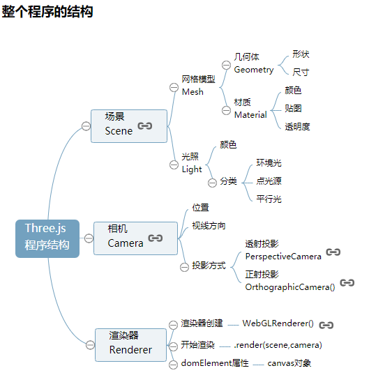
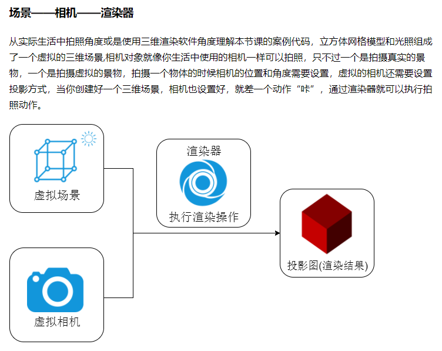
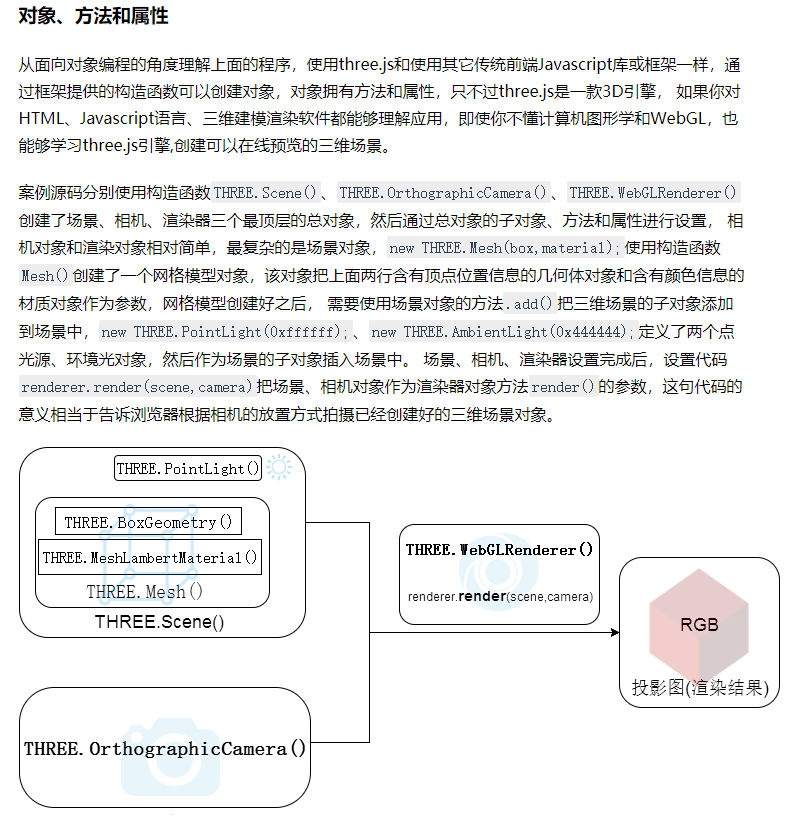
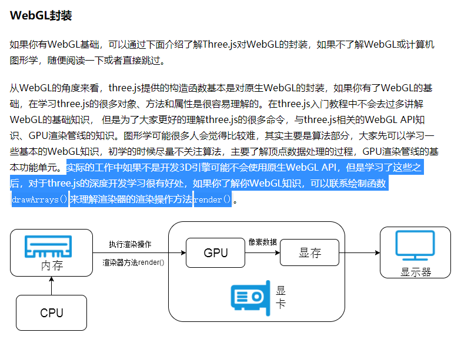

# Threejs 基础

### 场景对象`Scene()`  
```
var scene = new THREE.Scene();
```

### 几何对象`Geometry()`  
```
// 创建球体几何体对象
var geometryA = new THREE.SphereGeometry(60,409,40);
// 创建立方体几何体对象
var materialB = new THREE.BoxGeometry(100,100,100);
```

### 材质对象`Material()`  
```
var material = new THREE.MeshLamberMaterial({
	color: 0x0000ff
});
```

### 网络模型对象`Mesh()`，将几何体对象和材质对象添加到场景中  
```
var mesh = new THREE.Mesh(geometryA, material);
scene.add(mesh);
```

### 光源对象`Light()`，创建光源对象并添加到场景中，具体介绍查看 ***three-note -> three-light.md***  
```
// 创建点光源对象，类似在室内开一盏灯那种，会有阴影生成，所以需要指定在什么位置发射光线出来
var point = new THREE.PointLight(0x0000ff);
// 设置点光源位置
point.position.set(400,200,300);
// 将点光源添加到场景中
scene.add(point);

// 创建环境光，散射光，模拟现实环境，不能影响阴影生成，必须和其他光源配合所以还需要点光源配合，它也不需要指定位置
var ombient = new THREE.AmbientLight(0x444444);
scene.add(ambient);
```

### 相机对象`OrthographicCamera()`，不太了解，后续了解后补充  
```
// 窗口宽度
var width = window.innerWidth;
// 窗口高度
var height = window.innerHeight;
// 窗口宽高比
var k = width / height;
// 三维场景显示范围控制系数，系数越大，显示的范围越大
var s = 200;
// 创建正射投影相机对象，具体传进去的参数后续了解
var camera = new THREE.OrthographicCamera(-s*k,s*k,s,-s,1,1000);
// 设置相机位置
camera.position.set(200,200,200);
// 设置相机方向，用于指向场景对象
camera.lookAt(sence.position);
```

### 渲染器对象`WebGLRenderer()`，将之前创建的场景对象和相机对象都渲染到DOM元素上  
```
// 创建渲染器对象  
var renderer = new THREE.WebGLRenderer();
// 设置渲染区域尺寸，width和height为上方相机对象用到的窗口尺寸参数
renderer.setSize(width,height);
// 设置渲染区域背景颜色
render.setClearColor(0xb9d3ff,1);
// 在body元素中插入cancvas对象
document.body.appendChild(renderer.domElement);
// 执行渲染操作，添加上方创建的场景对象和相机对象
renderer.render(scene,camera);
```

### Threejs整个程序的结构


### 如何理解Threejs在程序中的渲染


### 通俗的Three概览


### 我可能永远无法达到的高度
